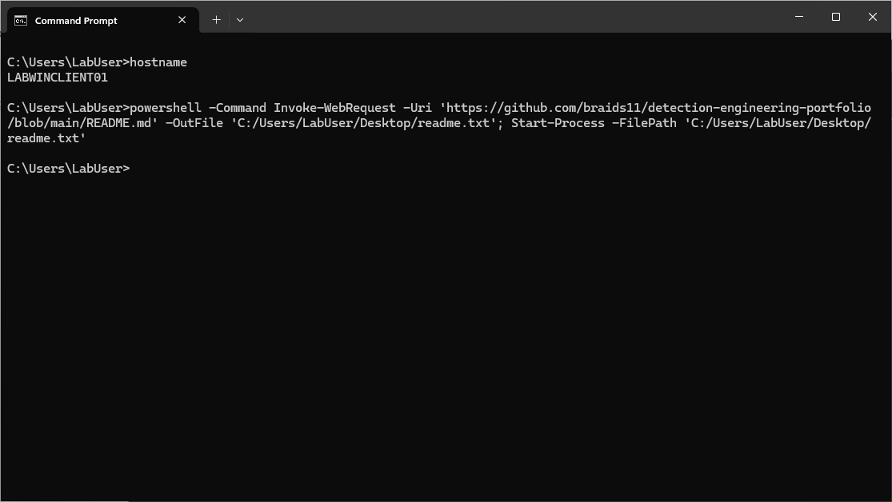
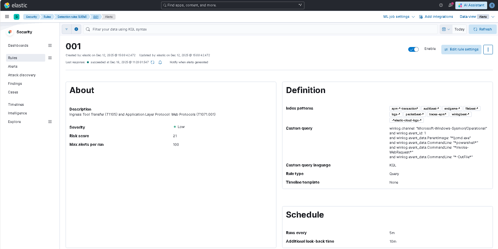

# Detecting PowerShell Payload Staging via Web Protocols

> **Estimated Read Time:** ~3 minutes

## 1. Inspiration & Context

This detection engineering exercise was inspired by a talk at ATT&CKcon titled “What the Adversary Taught Me: Using MITRE ATT&CK to Identify TTP Trends and Prioritize Detections” by Krysta Horocofsky and Connor Kovacs from Recorded Future’s Insikt Group.

During the [presentation](https://mitre.app.box.com/s/3lynwg8ebc80lolprvz144ev8n04p19v/file/2025241729734), they demonstrated how their intelligence analysis identified [Ingress Tool Transfer (T1105)](https://attack.mitre.org/techniques/T1544) and [Application Layer Protocol: Web Protocols (T1071.001)](https://attack.mitre.org/techniques/T1071/001/) as two techniques that frequently appear together across real world threat activity. 

Motivated by this example, I selected this technique pairing as a starting point to evaluate my detection engineering approach by building and validating a behavior-based detection rule in a controlled home lab using the Elastic Stack. The detection focuses on PowerShell-based payload staging over web protocols and is mapped to MITRE ATT&CK techniques.

## 2. Adversary Behavior Overview

## 3. Data Sources & Telemetry

## Lab Setup & Execution

## References 
